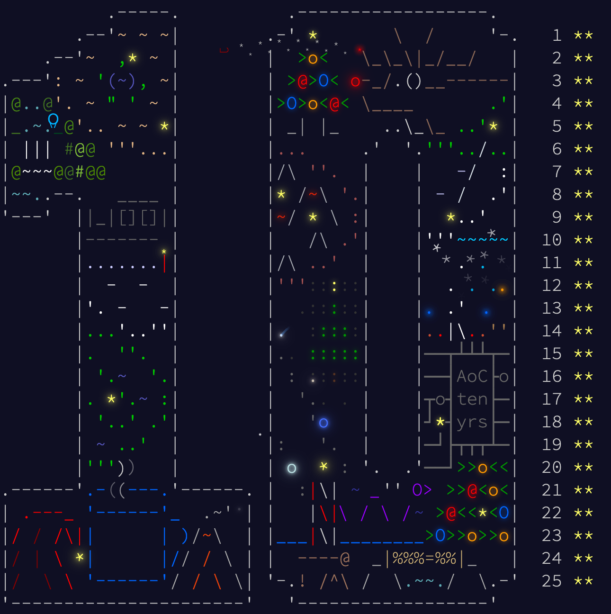

# Advent of Code 2024

Despite being a programmer for quite a few years now and working with the JVM on a daily basis (since Scala is my main
programming language), I've never actually actively developed anything in Java. Not even an original "Hello, world".

Unfortunately, every once in a while, I have to interact with some Java code, mostly in the form of source code for
libraries and frameworks that I use through Scala ([Apache Beam](https://beam.apache.org/) being a notable example).

To combat my fear of the unknown, I've decided to familiarize myself with the original Beast™️and write my solutions to
this year's Advent of Cod in Java. Wish me luck.

Built with Java 23.


## Starting a new day 🌞

To automatically create a new solution for the day, run the following command:

```bash
make
```

To create a new solution for a specific day, run the following command:

```bash
make DAY=3
```

It will also download the input for the day using [aoc-cli](https://github.com/scarvalhojr/aoc-cli).

## Execution times 🏎️

Measured on an M1 Macbook Pro. Compilation time is not included.

If some additional setup for both parts was used before solving them, it will be included in the `Total running time`
column.

| Day    | Part 1 | Part 2 | Total running time |
|--------|--------|--------|--------------------|
| **1**  | 2 ms   | 10 ms  | 41 ms              |
| **2**  | 5 ms   | 5 ms   | 36 ms              |
| **3**  | 7 ms   | 1 ms   | 24 ms              |
| **4**  | 11 ms  | 89 ms  | 44 ms              |
| **5**  | 30 ms  | 57 ms  | 110 ms             |
| **6**  | 3 ms   | 196 ms | 230 ms             |
| **7**  | 23 ms  | 872 ms | 911 ms             |
| **8**  | 9 ms   | 1 ms   | 43 ms              |
| **9**  | 2.7 s  | 2.5 s  | 5.2 s              |
| **10** | 1 ms   | 0 ms   | 43 ms              |
| **11** | 11 ms  | 36 ms  | 61 ms              |
| **12** | 3 ms   | 7 ms   | 1.8 s              |
| **13** | 64 ms  | 6 ms   | 86 ms              |
| **14** | 22 ms  | 1.3 s  | 1.3 s              |
| **15** | 37 ms  | 26 ms  | 76 ms              |
| **16** | 63 ms  | 9.2 s  | 9.3 s              |
| **17** | 1  ms  | 14  ms | 35 ms              |
| **18** | 56 ms  | 10. 2s | 10.2 s             |
| **19** | 1 ms   | 1 ms   | 142 ms             |
| **20** | 1.2s   | 1.4 s  | 2.6 s              |
| **21** | 34 ms  | 18 ms  | 62 ms              |
| **22** | 2 ms   | 532 ms | 642 ms             |
| **23** | 13 ms  | 79 ms  | 128 ms             |
| **24** | 6 ms   | -      | 40 ms              |
| **25** | 13 ms  | -      | 37 ms              |


